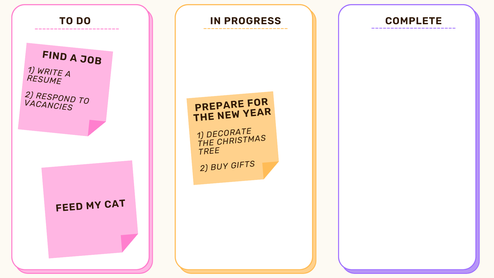

# Task tracker
My first training project is a task tracker, which allows you to manage both your tasks and effectively
organize joint work on tasks, dividing them by importance:
- SUBTASK
- TASK
- EPIC

and degree of completion:
- NEW
- DONE
- IN_PROGRESS

The program works with the application's memory and files.
The project is covered with unit tests.

## Content
- [Stack](#stack)
- [Usage](#usage)
- [Sources](#sources)

## Stack
- Java 11
- JSON, GSON
- JUnit5

## Usage
- Download this repository
- Execute the command
```sh
mvn clean install
```
- Run the Jar file, where filename is the name of the executable file
```sh
java -jar filename.jar
```

## Sources
The program is responsible for generating the data model for this page:
